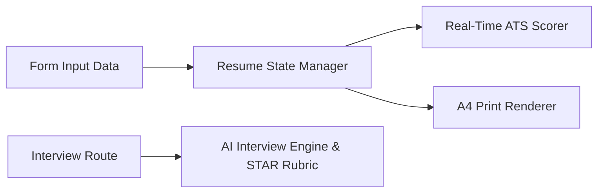

# 📄 CraftCV AI — Intelligent ATS Resume Studio & Interview Coach

> **Live Demo:** [https://olyxmintabansos-byte.github.io/craftcv-ai/](https://olyxmintabansos-byte.github.io/craftcv-ai/)  
> **AI Interview Coach:** [https://olyxmintabansos-byte.github.io/craftcv-ai/interview/](https://olyxmintabansos-byte.github.io/craftcv-ai/interview/)

CraftCV AI adalah platform karir terintegrasi yang menggabungkan studio pembuatan resume berstandar ATS (Applicant Tracking System) split-screen real-time dan simulator wawancara teknis AI interaktif dengan rubrik evaluasi STAR.

## 🚀 Fitur Utama
- **Split-Screen ATS Resume Builder:** Editor live interaktif berdampingan dengan preview kertas A4 pixel-perfect.
- **3 Template ATS Dinamis:** Modern Minimalist, Tech Lead Executive, dan Classic Academic.
- **Real-Time ATS Score Engine:** Kalkulasi skor keterbacaan bot HRD berbasis kata kunci teknis, metrik dampak, dan panjang teks.
- **AI Technical Interview Coach (/interview):** Simulasi wawancara kerja teknis dengan live audio/text feedback, timer, dan evaluasi rubrik STAR.
- **Export PDF Siap Cetak:** Format cetak standar global tanpa watermark.

## 🏗️ Diagram Arsitektur

