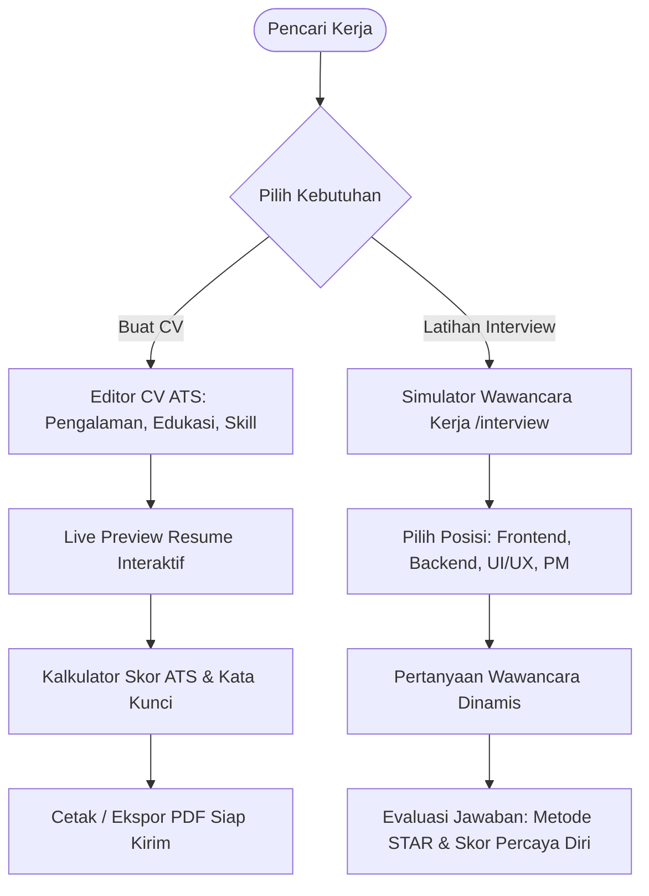

# 📄 CraftCV AI — Intelligent Resume Builder & Interview Simulator

<p align="center">
  
  
  
  
  
  
  
</p>

<p align="center">
  🌐 <strong>Live Playable Website:</strong><br>
  👉 <a href="https://olyxmintabansos-byte.github.io/craftcv-ai/" target="_blank"><strong>https://olyxmintabansos-byte.github.io/craftcv-ai/</strong></a>
</p>

---

> **Platform Pembuat Resume ATS-Friendly Berbasis AI & Simulator Wawancara Kerja Interaktif — Tulis CV Profesional, Dapatkan Skor Kompatibilitas ATS, dan Latih Jawaban Wawancara Kerja dengan Umpan Balik Instan.**

**CraftCV AI** hadir untuk memecahkan dua masalah terbesar para pencari kerja: membuat curriculum vitae yang lolos sistem Applicant Tracking System (ATS), serta melatih kepercayaan diri dalam menghadapi sesi wawancara kerja teknis dan perilaku (*behavioral interview*).

---

## 📑 Daftar Isi

- [Live Demo](#-live-demo)
- [Diagram Alur Aplikasi](#-diagram-alur-aplikasi)
- [Fitur Utama](#-fitur-utama)
- [Modul & Halaman](#-modul--halaman)
- [Teknologi yang Digunakan](#-teknologi-yang-digunakan)
- [Struktur Folder](#-struktur-folder)
- [Cara Menjalankan Secara Lokal](#-cara-menjalankan-secara-lokal)
- [Lisensi & Atribusi Hak Cipta](#-lisensi--atribusi-hak-cipta)

---

## 🌟 Live Demo

Buat CV dan uji coba simulasi interview kerja langsung di browser Anda:  
👉 **[https://olyxmintabansos-byte.github.io/craftcv-ai/](https://olyxmintabansos-byte.github.io/craftcv-ai/)**

---

## 🔄 Diagram Alur Aplikasi



---

## ✨ Fitur Utama

- 📝 **Live ATS-Optimized Resume Editor (`/`):** Form pengisian terstruktur yang dirancang agar struktur heading dan tag pengalaman dapat dipindai sempurna oleh bot ATS perusahaan global.
- 🎨 **Multiple Professional Templates:** Penggantian tema dan tata letak resume secara instan (Modern Tech, Minimalist Executive, Creative Portfolio).
- 🎯 **ATS Keyword Matcher & Scoring:** Memindai deskripsi pekerjaan sasaran dan membandingkannya dengan isi resume Anda untuk memberikan saran perbaikan kata kunci industri.
- 🎙️ **Simulasi Wawancara Interaktif (`/interview`):** Uji kesiapan Anda dengan serangkaian pertanyaan teknis dan skenario situasi (*STAR: Situation, Task, Action, Result*).
- 🖨️ **Pixel-Perfect PDF Print:** Menggunakan stylesheet `@media print` khusus agar hasil cetak PDF bersih tanpa potongan halaman yang rusak.

---

## 🧭 Modul & Halaman

| Rute | Modul | Deskripsi |
|---|---|---|
| `/` | **Resume Builder** | Editor resume interaktif, live split-screen preview, dan kontrol tata letak. |
| `/interview` | **Interview Simulator** | Platform latihan wawancara kerja dengan pewaktu respons dan bank pertanyaan realistis. |

---

## 🛠️ Teknologi yang Digunakan

- **Framework:** [Next.js 16](https://nextjs.org/) (App Router Architecture)
- **Library UI:** [React 19](https://react.dev/)
- **Bahasa:** [TypeScript](https://www.typescriptlang.org/)
- **Styling:** [Tailwind CSS v4](https://tailwindcss.com/)
- **Ikonografi:** [Lucide React](https://lucide.dev/)
- **Penyimpanan:** Browser `localStorage`

---

## 📁 Struktur Folder

```text
craftcv-ai/
├── src/
│   ├── app/
│   │   ├── interview/       # Halaman Simulator Wawancara Kerja
│   │   ├── globals.css      # Styling dasar & print layout
│   │   ├── layout.tsx       # Master layout
│   │   └── page.tsx         # Resume Builder & Live Preview
│   ├── components/          # Template CV, formulir pengalaman, widget skor ATS
│   ├── types/               # Tipe data resume, profil, dan pertanyaan
│   └── lib/                 # Logika scoring ATS & bank soal wawancara
├── public/                  # Aset statis
├── package.json
└── tsconfig.json
```

---

## 🚀 Cara Menjalankan Secara Lokal

```bash
# Clone repository
git clone https://github.com/olyxmintabansos-byte/craftcv-ai.git
cd craftcv-ai

# Install dependensi
npm install

# Jalankan server
npm run dev
```
Akses URL `http://localhost:3000` di peramban Anda.

---

## 📄 Lisensi & Atribusi Hak Cipta

<p align="center">
  
  
</p>

<p align="center">
  Crafted with passion & precision by <strong><a href="https://github.com/olyxmintabansos-byte">Olyx</a></strong><br>
  <strong>© 2026 by Olyx (@olyxmintabansos-byte)</strong>. All rights reserved.<br>
  Distributed under the <a href="https://opensource.org/licenses/MIT">MIT License</a>.
</p>
